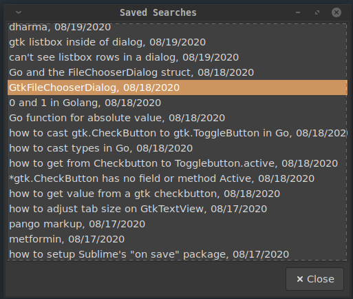

# _descq_ documentation
### for Linux

_descq_ is a GUI entry field that you position on your Linux desktop from which you
can search the Internet or submit commands to your computer.

For the __Windows__ version see https://github.com/MLeidel/BCBW

**Features:** 
1. Save URLs and recall them later
1. Save clipboard text and access later
1. Start Internet searches (keeps history)
1. Set up searches for specific services (like: Maps, Images, Amazon, ...)
1. Set up commands to launch apps, sys commands, or URLs

> 3 - 5 are also available at the command line.

------
## Installing descq
download and install the .deb file.

---

descq is written in C and uses Gtk3 - so
it integrates nicely with Linux Gtk based
desktops.

---

Type __cap__ to _toggle_ the 
window caption bar on and off.
Position descq on your desktop.
Then type __winset__ to save the windows geometry and 
caption status (_winmet.txt_.) 

 
 

> *above descq was positioned along side an xfce panel.* 

## descq commands:

Activate the request you've typed by hitting
_Enter_, _Tab_, or click the _action-button_ &#9744;.

| Type this | action/description |
| :----- | :---- |
|_a URL_|saves URL to a list|
|_search text_|starts a search in browser|
|**sc** or _action-button_|saves clipboard contents|
|**list**|opens dialog with list of saved URLs|
|**hist**|opens dialog with list of saved search texts|
|**serv**|opens dialog with list of your commands|
|**cap**|toggles window caption bar|
|**winset**|saves window size/position settings|
|**eu**|edit saved URL list (urls.lst)|
|**ec**|edit saved clips text (clips.txt)|
|**eh**|edit saved search history (hist.csv)|
|**es**|edit custom command / services file (serv.txt)|
|**eq**|edit edit the search query engine URL (search.txt)|
|**ee**|edit edit the name of your text editor (editor.txt)|
|**top**|toggles the window level to Top or Bottom|
|**help**|view this help|
|**=**|Calculator eg. =2^2|
|**up/dn arrow** key|recall last 10 entries|
|**Esc** key|clear entry field|

---

## Search Requests and Command Requests

Type a web search into the entry box and hit Enter.

Multiple searches or commands are made by delimiting 
each with "|"

>For example, perform three searches with one command: 
**dogs|cats|tadpoles**

---

Directly execute an app installed on your system 
by prefixing it with one of these characters:  
"$" or "@" or ">"

For example: **>gimp**  
or **>gedit**

---

Evaluate math expressions using a leading "=" 
followed by the expression.

example:  
_=24.5^3 / 2.2_

---

### Save and recall URLs and text clippings.

- To save a URL copy or type it into descq and hit Enter. 
- To view and re-open saved URLs type **list** into descq and hit Enter. 


To save text from your system clipboard type **sc**  
or click the action-button &#9744; (with the _entry field empty_.) 

To view/edit saved text type **ec**.  
Your text editor will pop-up with the _clip.txt_ file.

---

Use the **hist** command to pop up a dialog of your 
saved searches. Click to search again. 



---

### Command aliases and website directed searches

Type **es** to edit the _serv.txt_ file. 

The _serv.txt_ file holds your aliases with 
custom commands and URLs.  
The entries in _serv.txt_ take two forms:
1. Aliases: URL links and system commands
1. Website Directed Searches

### Aliases 
 Aliases can be either URLs or system commands. 
 
 The general format is
 
 **_Alias_, {URL | _fullpath-command-line_}** 
 
 To create an alias first invent a name for 
 the command. The name is simply a "key" (alias) 
 that you will type in to launch the command.
 
 #### examples from a serv.txt file: 
 
 ```python
  git,https://github.com 
  dev,dev.sh 
  shutdown, shutdown now 
  reboot,reboot 
  drive, https://drive.google.com
 ```
 
 To perform these commands in descq you would type in 
 the alias and hit Enter or click the action button. 
 _descq_ will match on _leading_ characters or substrings 
 of your alias. 
 >Note: if you create an alias in _serv.txt_ and then 
 mistype it when using it, the mistyped alias will 
 be treated as a __search__ and launch it in the 
 browser.
 
 Using the above example aliases:
  
 | typed | resulting action |
 | :---------- | :-------------------- |
 |_git_|opens github.com in your browser| 
 |_dev_|executes your shell script to ... ?| 
 | _shut_|shuts down your machine| 
 |_shutdo_|shuts down your machine| 
 |_sh_|shuts down your machine| 
 |_reboot_|reboots your machine|
 |_reb_|reboots your machine|
 
 It helps to create your commands in _serv.txt_
 in assending order which should allow for unique substrings 
 as your commands become familiar from use.
 
 ---
 
### Website directed searches
 These are URLs that may have a ?querystring after 
 the domain and path part. To setup a web directed
 search in _serv.txt_ make sure that the 
 first character of each line begins with 
 a single letter (a-z, 1-0). 
 
 The general format is:
 
 __letter,name,website-URL + query-string...__ 
 where _letter_ = a unique letter a-z, A-Z, 0-9
 
 _**You may have to experiment with each website to learn 
 what format they expect for search queries**_ 
 
 #### Some examples: 
 
 ```python
 a,Amazon,https://smile.amazon.com/s/ref=nb_sb_noss_1?field-keywords=
 
 i,Google Images,http://images.google.com/images?q=
 
 p,Php,http://php.net/manual-lookup.php?pattern=
 
 m,Google Maps,https://www.google.com/maps/search/
 ```
Use like this:

>**a:**mini computers  
**i:**wallpaper for Linux Mint  
**p:**preg_split  
**m:**arlington, tx  

Note that what ever you enter after __letter:__ will get
appended to the website querystring that you've set up
in _serv.txt_.
 
 

It may take a little work to discover some of these 
querystrings but many do exist. _descq_ comes with 
several already set up.

---

#### Specify the text editor
The _"e\_"_ commands for _descq_ require a simple text editor.  
Put the name of your installed text editor into the first 
line of the _editor.txt_ file.  
___gedit___ is preset.  

To change this later use the "ee" command.

---

#### Specify the Search Engine
Descq uses the DuckDuckGo search engine as default.
Edit "search.txt" (or use the __ee__ command) to change it to
some other URL such as:

   - https://www.google.com/search?q=
   - https://duckduckgo.com/?q=
   - https://www.bing.com/search?q=
   - https://scholar.google.com/scholar?q=
   - https://search.yahoo.com/search?p=

---

One of the advantages of DDG is its 
BANG query feature. Checkout 
https://duckduckgo.com/bang 
to find out how it works.

#### List of descq System Files

| | |
| ----- | ----- |
|_clip.txt_ |text file of clippings|
|_descq_ |Linux executable|
|_hist.txt_ |text file of search history|
|_serv.txt_ |text file of $ commands and special querys|
|_winmet.txt_ |window geometry ...|
|_editor.txt_ |name of your text editor program|
|_urls.txt_ |text file of saved URLs|
|_search.txt_ |querystring to search with you favorite search engine|


#### end

 