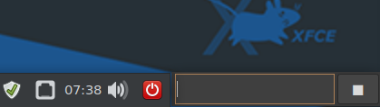

# descq
### for Linux
#### Streamline Workflow
descq (DeskQ) is a desktop GUI-Internet-search-window  
with added productivity like clipboard archiving  
and retrieval, and custom command aliasing.

**Features:**
1.  Save URLs and recall them later
1.  Save text from the clipboard and access later
1.  Start an Internet search (keeps history)
1.  Set up searches for specific services (like: Google Maps...)
1.  Set up aliases to launch programs, documents, or URLs

> 3 - 5 are also available at the command line.

------
## Installing descq
download and install the .deb file.

---

descq is written in C including Gtk3

---

You might want to configure descq to run on system startup
or link it to a hotkey.

---

To re-position use the `cap` command to toggle the
window caption bar on and off for window positioning.
The **`winset`** command saves the windows geometry and
caption status in winmet.txt.



*Here is descq positioned along side the xfce panel.*

**descq commands:**

| command/text | action/description |
| :----- | :---- |
|_a URL_|saves URL to a list|
|_search text_|starts a search in browser|
|**sc** or _action button_|saves clipboard contents|
|**list**|opens dialog with list of saved URLs|
|**hist**|opens dialog with list of saved search texts|
|**serv**|opens dialog with list of your commands|
|**cap**|toggles window caption bar|
|**winset**|saves window size/position settings|
|**eu**|edit saved URL list (urls.lst)|
|**ec**|edit saved clips text (clips.txt)|
|**eh**|edit saved search history (hist.csv)|
|**es**|edit custom command / services file (serv.txt)|
|**eq**|edit edit the search query engine URL (search.txt)|
|**ee**|edit edit the name of your text editor (editor.txt)|
|**top**|toggles the window level to Top or Bottom|
|**help**|view this help|
|**up/dn arrow** key|recall last command or search|
|**Esc** key|clear entry field|

---

_Use the **`hist`** command to pop up a dialog of your
saved searches. Click to search again._


## System commands and website directed searches

Use **`es`** to edit `serv.txt` file.

The `serv.txt` file holds your aliases for
custom commands and URLs.
The entries in `serv.txt` take two forms:
- Aliases: URL links and system commands
- Website Directed Searches

### Aliases
  Aliases can be either URLs or system commands.

  The general format is

  _Alias_, {URL | fullpath-command-line_}

  To create an alias first invent a name for
  the command. The name is simply a "key" (alias)
  that you will type in to launch the command.

  #### examples from a serv.txt file:
  ```text
    git,https://github.com
    dev,dev.sh
    shutdown,  shutdown now
    reboot,reboot
    drive, https://drive.google.com
  ```

  To perform these commands in descq you would type in
  the alias and hit Enter or click the action button.
  Deskq will match on _leading_ characters or substrings
  of your alias.
  _Note: if you create an alias in serv.txt and then
  mistype it when using it, the mistyped alias will
  be treated as a __search__ and launch it in the
  browser._

  Using the example aliases above:

  | typed | resulting action |
  | :---------- | :-------------------- |
  |`git`|opens github.com in your browser|
  |`dev`|executes your shell script to ... ?|
  | `shut`|shuts down your machine|
  |`shutdo`|shuts down your machine|
  |`sh`|shuts down your machine|
  |`reboot`|reboots your machine|
  |`reb`|reboots your machine|

  It helps to create your commands in "serv.txt"
  in assending order which should allow for unique substrings
  as your commands become familiar from use.

  ---

  Searches and/or aliases can be combined by delimiting
  with "|" eg. **git|dev|someothercommand|...**

  Perform three searches with one command:
  **dogs|cats|tadpoles**

  ---

  Directly execute an app installed on your system
  and in the system path like this:

  `$app`

  For example: `$gimp`

  "$" can be "$" or "@" or ">"

  ---
  
  Evaluate math expressions using a leading "="  
  followed by the expression:
  
  `=24.5^3 / 2.2`
  
  ---
  
### Website directed searches
  These are URLs that may have a ?querystring after
  the domain and path part.  In `serv.txt` the
  first character of each line must begin with
  a single letter (a-z, 1-0).

  The general format is:

  _?,name,website-URL + query-string..._
  where ? = a unique letter a-z, A-Z, 0-9

  _**You may have to experiment with each website to learn
  how it formats their search querystring.**_

  #### Some examples:

  `a,Amazon,https://smile.amazon.com/s/ref=nb_sb_noss_1?field-keywords=`

  `i,Google Images,http://images.google.com/images?q=`

  `p,Php,http://php.net/manual-lookup.php?pattern=`

  `m,Google Maps,https://www.google.com/maps/search/`

  

For example: __m:arlington, TX__

It may take a little work to discover some of these
querystrings but many do exist. DeskQ comes with
several already set up.

### Save and recall URLs and text clippings.

To save a URL copy or type it into descq and hit Enter.
To view and re-open saved URLs type **`list`** into descq and hit Enter.


To save text from your system clipboard just type **`sc`**
or click the action button with the entry field empty.

To view/edit text you've saved just type **`ec`** Enter.
Your text editor will pop-up with all of your clips.

#### Specify the text editor
The "e_" commands for DeskQ require a simple text editor.
Put the name of your installed text editor into the first
line of the `editor.txt` file. It comes with `gedit` in the file.
* _examples:_
  `subl`
  `gedit`
  `xed`
  `atom`
  `gedit`
  `whatever`

#### Specify the Search Engine
The search engine query string is set to DDG
by default. You can change it by editing
the `search.txt` file to the query string
for your favorite search engine.

One of the advantages of DDG is its
BANG query feature. Checkout
https://duckduckgo.com/bang
to find out how it works. Very cool!

#### List of descq System Files

| |  |
| ----- | ----- |
|`clip.txt`|text file of clippings|
|`descq`|Linux executable|
|`hist.txt`|text file of search history|
|`serv.txt`|text file of $ commands and special querys|
|`winmet.txt`|window geometry ...|
|`editor.txt`|name of your text editor program|
|`urls.txt`|text file of saved URLs|
|`search.txt`|querystring to search with you favorite search engine|


#### end
